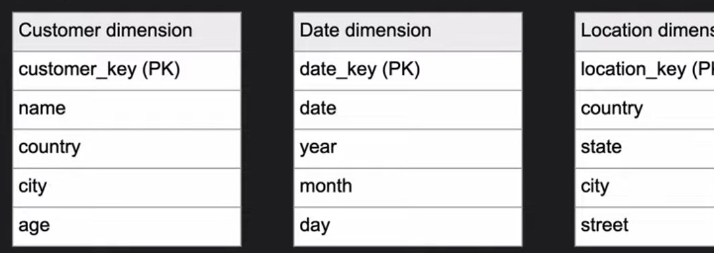
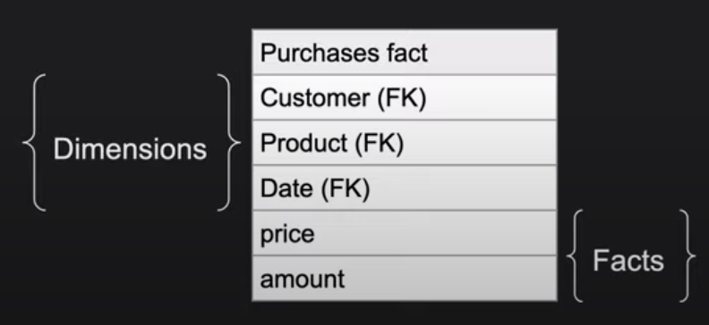
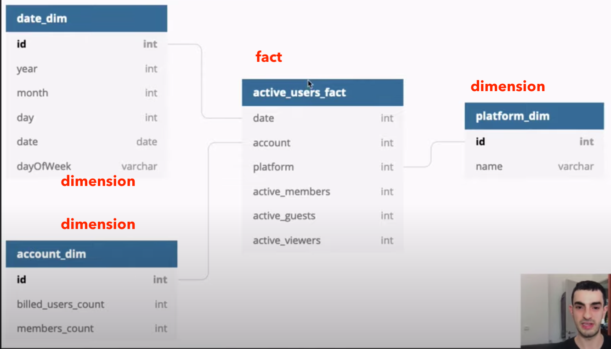

# Database
- [Dimensional Modeling](#dimensional-modeling)
- [Normalization](#normalization)

## Dimensional Modeling
Optimize the database for faster retrieval of data

- In contrast, **relation models** are optimized for addition, updating and deletion of data.

### Steps of Dimensional Modelling
1. Identify Business Process
2. Identify **Dimensions**
  - 
  - By what we meature things: who, what, when, where, etc.
  - Example:
    - The CEO at an MNC wants to find the sales for specific products in different locations on a daily basis.
    - Dimensions: Product, Location and Time
    - Attributes: For Product: Product key (Foreign Key), Name, Type, Specifications
    - Hierarchies: For Location: Country, State, City, Street Address, Name
3. Identify Facts
  - 
  - An observation or event. Something to be measured.
  - Examples: Customer payment, user logins, product orders.
4. Build Star schema
  - 
  - The marriage of dimension tables and fact tables
5. Identify Grain
  - What each fact row contains and in what detail
  - Example:
    - Do we need to store all the available products or just a few types of products? This decision is based on the business processes selected for Datawarehouse
    - Do we store the product sale information on a ***monthly, weekly, daily or hourly*** basis? This decision depends on the nature of reports requested by executives
    - "Platform" dimension: "mobile/desktop" or "iOS/Android/Windoes/Mac"
    - How do the above two choices affect the database size?
  - Example:
    - The CEO at an MNC wants to find the sales for specific products in different locations on a daily basis.
    - So, the grain is “product sale information by location by the day.”

### Future Reading
- (https://www.guru99.com/dimensional-model-data-warehouse.html#2)
- [Data warehouse schema design - dimensional modeling and star schema](https://www.youtube.com/watch?v=fpquGrdgbLg)

## Normalization
- Purpose: reduce data redundency

### 1NF
- Atomic values (No `X,Y` or `Z,W`)
- Values of the same type
- Unique column name
- Order of saved data doesn't matter

### 2NF
- Should not have partial dependency: a column on the table depends on partial of the primary key

### 3NF
- Should not have transitive dependency: a column on the table depends on a column that's not the primary key
