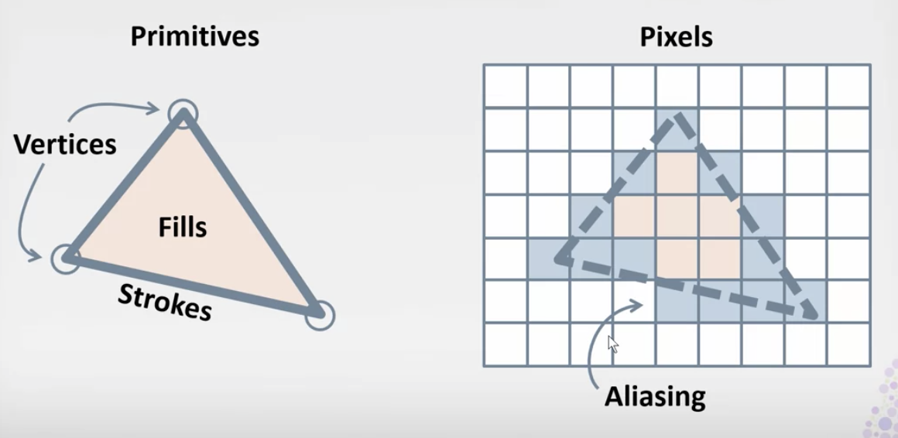
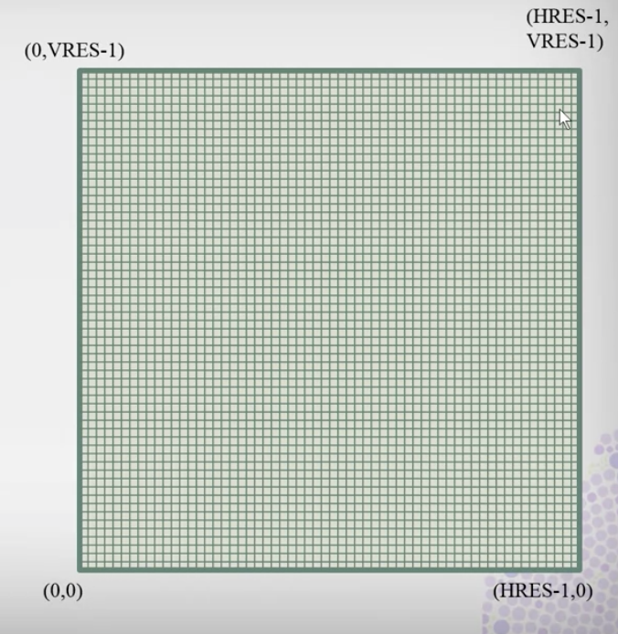
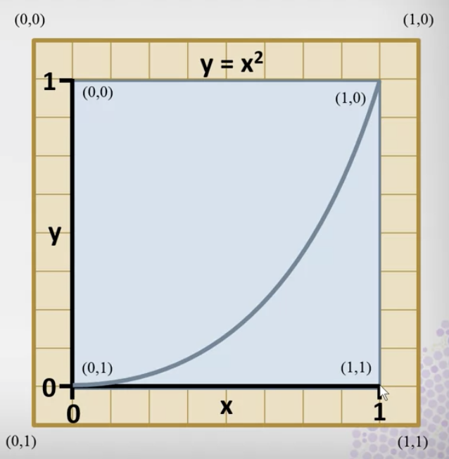
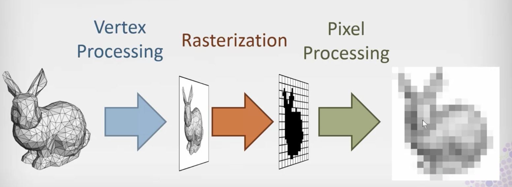
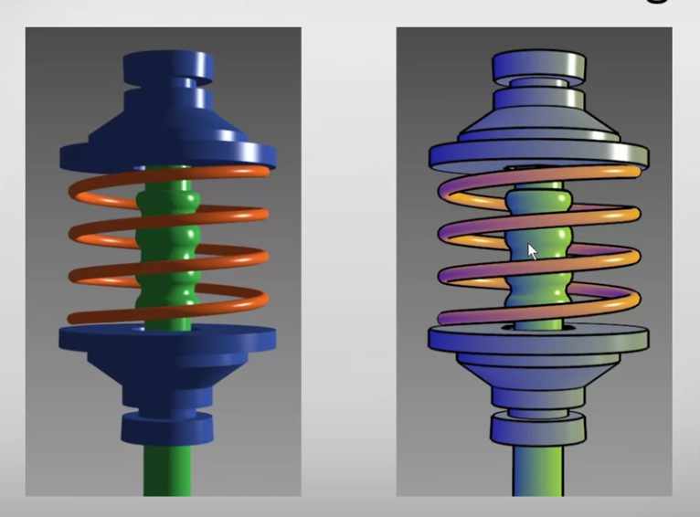

# The Computer and the Human

## Graphics, Drawing, and Photorealism
1. [2-D Graphics](#2-d-graphics)
2. [2-D Drawing](#2-d-drawing)
4. [3-D Graphics](#3-d-graphics)
5. [Photorealism](#photorealism)
6. [Non-Photorealism](#non-photorealism)

## Humans and Visualization
1. [Reasoning](#reasoning]

### 2-D Graphics

#### Vector v. Raster Graphics
- Vector Graphics
  - Describes shapes with verticles, strokes, and fills
  - Used for drawing
- Raster Graphics
  - Describes shapes with a table of pixels
  - used for TV, phones
  - Vector graphics are converted to raster graphics for display
  - rectilinear array of pixels and pixels are assigned colors
- Rasterization: 
  - 
  - Primitives: a vector graphics format that consists of verticles, strokes, fills
  - Converts the primitives into an array of pixels so that  they can be displayed
  - Aliasing: get stairstep artifacts when rasterizing a smooth straight line
  
#### Canvas Coordinates
- Can redefine corners of canvas coordinates to whatever is convenient
- Can use coordinates for domain and range
- Hierarchical Coordinate Systems: canvas in canvas
  - 

#### Screen Coordianates
_For raster graphics, display of information_
- Per-pixel integer coordinates
- 

#### Canvas -> Screen Transformation
_2D graphics plotting on canvas can be automatically resized and repositioned anywhere on the screen_

- Can use same coordinates for both canvas and screen coordinates, results in non-scalable resolution dependent output, not recommended

### 2-D Drawing
#### SVG (Scalable Vector Graphics)
_Format specification for describing 2-D graphics_
- Embedded in HTML with <svg> tag
  ```html
  <svg width=pw height=ph viewbox="x y w h"></svg>
  ```
  - viewbox: creates a drawing canvas x, y are the upper left corner
- Example:
  ```html
  <svg width=... height=... viewbox="0 0 1 1">
    <svg x="10%" y="10%" width="80%" height="80% viewbox="0 0 1 1">
  ```

  

#### Path
- Example
   ```html
  <path d="M 0.2 0.1
           L 0.2 0.3
           L 0.4 0.3
           Z"
        fill = blue />
  ```
  - `M`: move to a new position without drawing a line
  - `L`: move to a new position while drawing a line
  - `Z`: close the path

### 3-D Graphics
_Displays objects that are made out of triangle meshes_

#### 3-D Graphics Pipeline

                                          
- Vertex Processing: taking vertices of triangles and projecting them onto an image plane
- Rasterization: taking two-dimensional triangles and converting them into pixels
- Pixel Processing: taking pixel regions and figures out what colors hould be on their interior

### Photorealism
_Describes visual cues that tell our perceptual system that when it see a two-dimensional image, it's seeing a depiction of a three dimensional scene_
- Cues: occlusion, shadowing, perspecitve, stereopsis, focus, lighting, texturing, attenuation
- Occlusion: most objects are opaque and hide objects behind them, strongest cue
- Illumination: cues the orientation of a surface
- Shadowing: cuces object relative positions
- Perspective: farther things appear smaller
- Stereopsis: rendering from two different viewpoints, one for each eye, useful when other cues are unavailable

### Non-Photorealism

                                          
- focuses on the psychology of perception, emphasizes the outlines, the visual contours
- photorealistic: focuses on the physics of light

## Humans and Visualization
### Reasoning
- Deductive reasoning: if A then B, draw a conclusion
- Inductive reasoning: if true for x, then true for x+1, make a generalization
- Abductive reasoning: ask questions, try to predict how an event happened

### Human Retina


