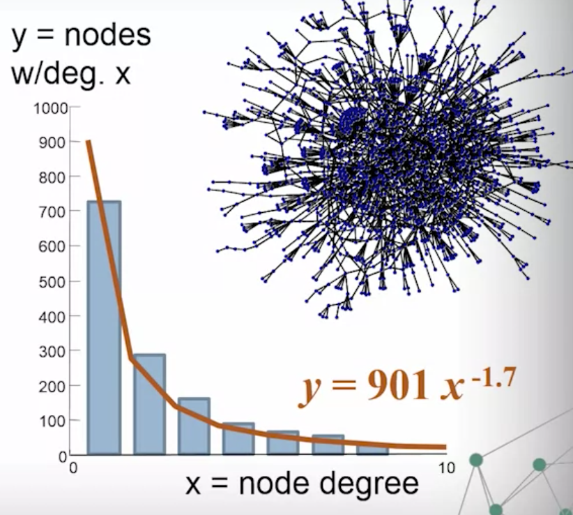
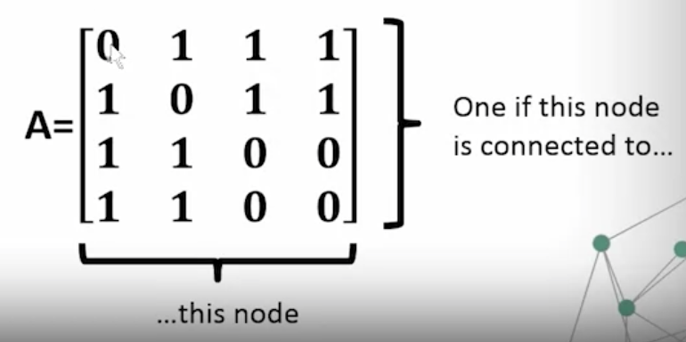
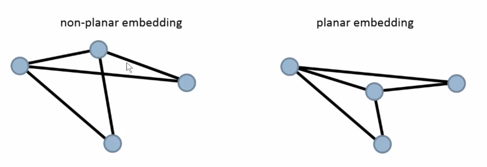
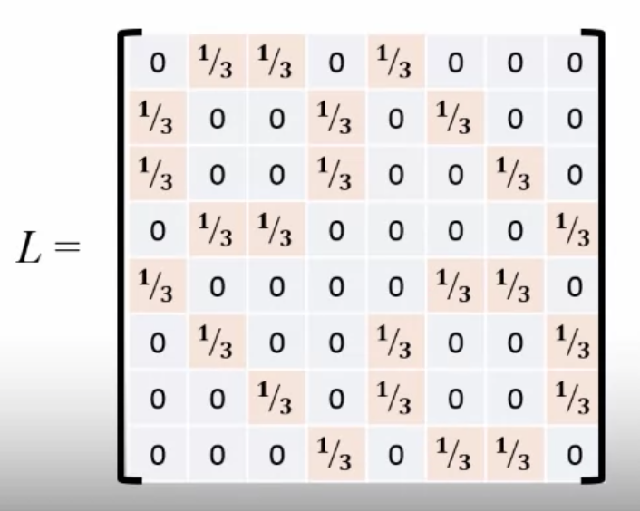
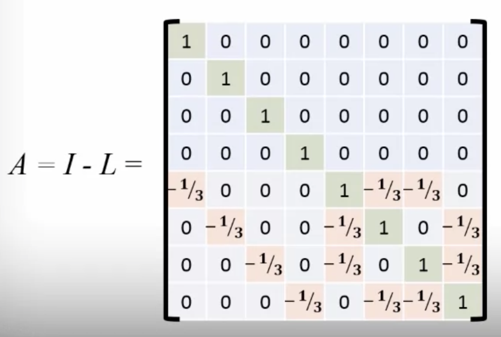
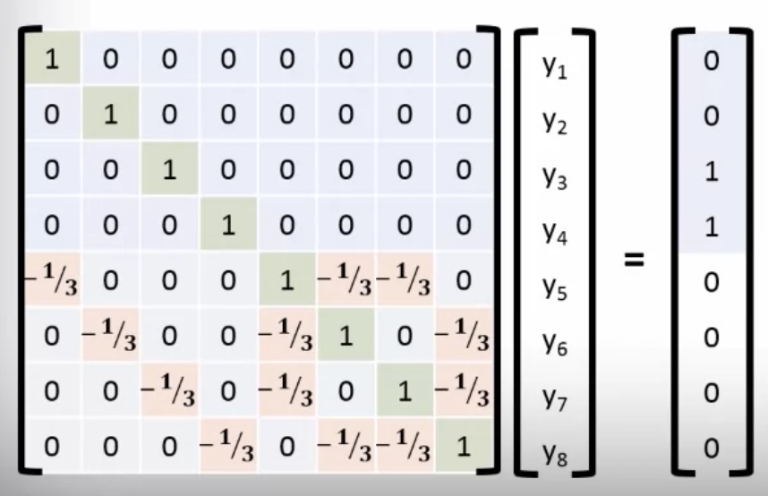

# Visualization of Non-Numeric Data

## Graphs and Networks
### Graphs
- Directed v. undirected
- Cyclic v. acyclic
- Tree: minimally connected, n nodes, n-1 edges
- Hierarchy: acyclic direected graph

### Face
_The region bounded by cycle of edges, starting and ending at the smae node_

### Isomorphic
_Two different embeddings of the same graph

### Node Degree
_= Number of edges_

- Directed graph nodes have an in-degree and an out-deggree
- Social networks
  - many low degree nodes and fewer high deggree nodes
  - logarithmic, power-law graphs
  
  
### Adjacency Matrix
_Matrix representation of a graph_

- Square matrix: # of rows & columns = # of nodes
- [i, j] is set to 1 if edge connects i and j
- Symmetric, unless directed graph
- Diagonal represent edge between node and itself

## Embedding Planar Graphs
### Planar Embedding
_Edges connecting the nodes don't cross_

### Graph Embedding
- Create the graphc Laplacian Matrix: Adjacency matrix with elements  for an edge between i and j

  

- Zero out the rows for nodes we have already positioned, subtract it from the identity matrix

  
- Create linear systems of equations
  - Solve  for x coordinates
  - Solve  for y coordinates

  
  
