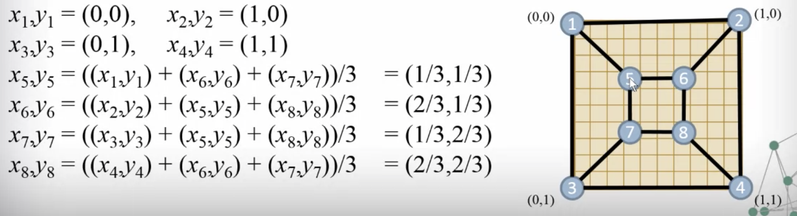
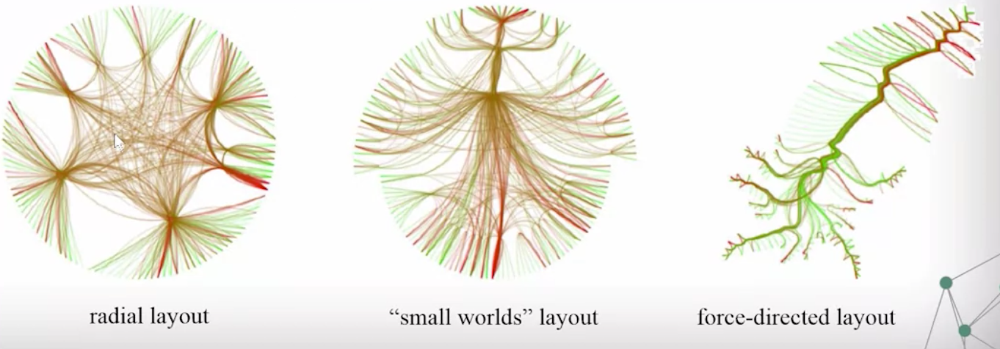

# Visualization of Non-Numeric Data
- [Graphs and Networks](#graphs-and-networks)
- [Embedding Planar Graphs](#embedding-planar-graphs)
- [Graph Visualization](#graph-visualization)
- [Principal Component Analysis](#principal-component-analysis)

## Graphs and Networks
### Graphs
- Directed v. undirected
- Cyclic v. acyclic
- Tree: minimally connected, n nodes, n-1 edges
- Hierarchy: acyclic direected graph

### Face
_The region bounded by cycle of edges, starting and ending at the smae node_

### Isomorphic
_Two different embeddings of the same graph

### Node Degree
_= Number of edges_

- Directed graph nodes have an in-degree and an out-deggree
- Social networks
  - many low degree nodes and fewer high deggree nodes
  - logarithmic, power-law graphs
  
  
### Adjacency Matrix
_Matrix representation of a graph_

- Square matrix: # of rows & columns = # of nodes
- [i, j] is set to 1 if edge connects i and j
- Symmetric, unless directed graph
- Diagonal represent edge between node and itself

## Embedding Planar Graphs
### Planar Embedding
_Edges connecting the nodes don't cross_

### Graph Embedding
- Create the graphc Laplacian Matrix: Adjacency matrix with elements  for an edge between i and j

  

- Zero out the rows for nodes we have already positioned, subtract it from the identity matrix

  
- Create linear systems of equations
  - Solve  for x coordinates
  - Solve  for y coordinates

  
  

## Graph Visualization
### GEM Force Directed Layout
- Edges exert spring force on their nodes
  - Spring force diminished by node degree, making higher degree nodes "heavier"
- Nodes mutually repel each other
  - strength ~ 1/distance
- All nodes experience global forces
  - Gravitational force toward center

### Centralities
_A way of analyzing where a node should be positioned in a layout_
- Node degree: high degree appears in the center, low degree appears on the boundary
  - e.g. PageRank: sum of PageRanks of incoming links
- Isolation metric: total distance to all other nodes
  - Distance: the shorted number of edges to get from one node to another node
  - Closeness centrality = 1/ isolation metric
  - Graph centrality = 1/ distance to the farthest node
- Betweeness centrality
  - portion of all shortest paths between any two nodes that pass through the given node

### Edge Bundles
_Aggregate "similar" edges into "wire bundles" to simplify presentation_

### Community Discovery
- Remove edges in order of decreasing Between Centrality
- As higher BC edges merge lower-level communities

## Principal Component Analysis

