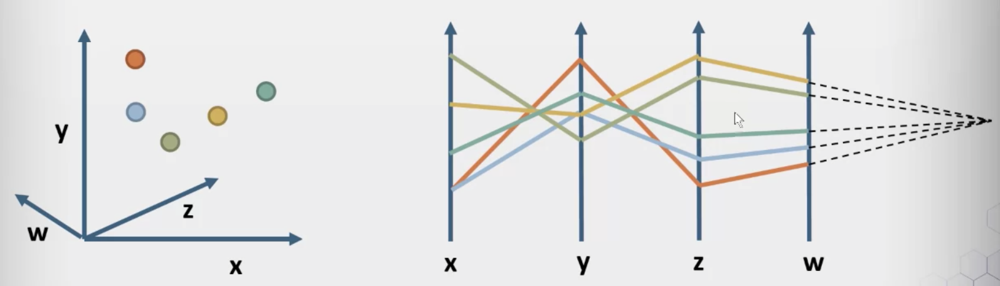
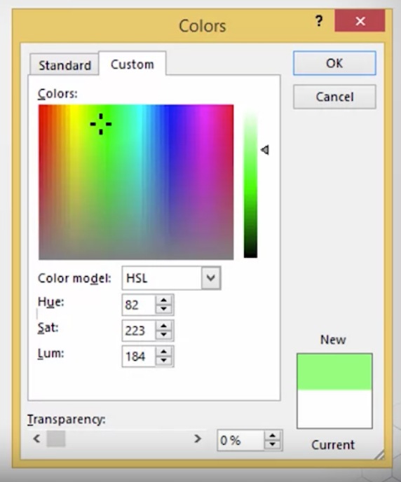

# Visualization of Numerical Data

## Glyphs, Parallel Coordinates, and Stacked Graphs
### Glyphs
_Represented visually as part of a data visualization_


### Parallel Coordinates
_Lay out the orthogonal axes in the Cartesian coordinate system in parallel_



- Collinearity: convergence in parallel coordinates

## Tufte's Design Rules and Using Color
### Tufte's Design Rules
- Let the Data Speak: avoid summaries and aggregations
- Annotation: label the axes
- Chartjunk: prettier charts are often less effective at communication
- Data-Ink ratio: don't waste ink on elements not associated with data
- Multiples: consistent design
- Narrative: tell a story

### Hue, Saturation and Value



- Value: how bright the color is, distance from black
  ```python
  V = max(R, G, B)
  ```
- Saturation: how intance a color is, distance from gray
  ```python
  S = (V - min(R, G, B))/V
  ```
- Hue: angle around the color wheel
  - 0: red
  - 60: yellow
  - 120: green
  - 180: cyan
  - 240: blue
  - 300: magenta
  ```python
  if (V == R) then H = (G-B)/(V - min(R, G, B)
  else if (V == G) then H = (B-R)/(V - min(R, G, B))
  else H = (R-G)/(V - min(R, G, B)
  H = (60 * H) mod 360
  ```
