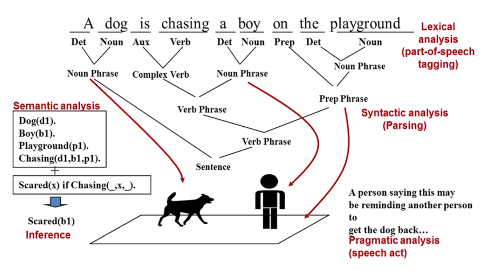
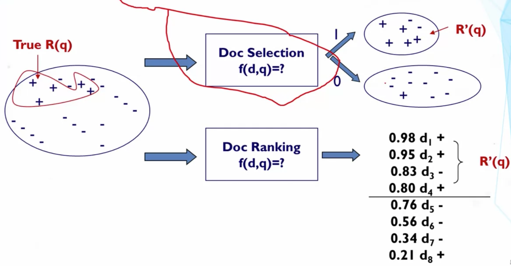

# Overview

## Guiding Questions
- **What does a computer have to do in order to understand a natural language sentence?** 

  
  
  1. Lexical analysis (part-of-speech tagging): tag Noun, Verb, Prep, etc.
  2. Syntactic analysis (parsing): some words go together first, and then go with other wordsantic analysis  - know the structure of the sentence
  3. Semantic analysis: use symbols to denote objects and relationship - know the meaning of the sentence
  4. Inference
  5. Pragmatic analysis (speech act): the goal of the sentence
  
- **What is ambiguity?**
  - Word-level ambiguity: design can be a noun or a verb
  - Syntactic ambiguity
    - Modification: "natural language processing"
    - Prepositional phrase (PP) attachment: "A man saw a boy *with a telescope*"
  - Anaphora resolution: "John persuaded Bill to buy a TV for *himself*"
  - Presupposition: "He has quit smoking" implies he smoked before
  
- **Why is natural language processing (NLP) difficult for computers?**
  - Natural language is designed for human, we omit a lot of "common sense" knowledge, keep a lot of ambiguities
  
- **What is bag-of-words representation? Why do modern search engines use this simple representation of text?**
  - Keep individual words, but ignore the orders of words
  - When searching, related words often appear together which helps understand, e.g. "Java applet" and "Java coffee"
  
- **What are the two modes of text information access? Which mode does a web search engine such as Google support?**
  - Pull (search engines): users take initiative, ad hoc information
    - Querying: user enters a query, system returns relevant document
    - Browsing: user navigates into relevant information by following a path enabled by the structures on the documents
    - Want to combine the two way
  - Push (recommender systems): systems take initiative, stable information need
  - Combine the two in sophisticated information system
  
- **When is browsing more useful than querying to help a user find relevant information?**
  - Querying: works well when the user knows what keywords to use
  - Browsing: works well when user wants to explore information
  
- **Why is a text retrieval task defined as a ranking task?**
  - The problem of Selection
    - Over-constrained (no relevant) / Under-constrained (over delivery), hard to find the position between two extremes
    - All relevant documents are not equally relevant, prioritization is needed
    
- **What is a retrieval model?**

- **What are the two assumptions made by the Probability Ranking Principle?**
  1. The utility of a document (to a user) is independent of the utility of any other document
    - Not really true when a user has already seen a similar/duplicated document before, or multiple documents are only userful to users when they are put together
  2. A user would browse the results sequentially
    - Evidence shows that users don't always just go strictly sequentially through the entire list

- What is the Vector Space Retrieval Model? How does it work?
- How do we define the dimensions of the Vector Space Model? What does “bag of words” representation mean?
- What does the retrieval function intuitively capture when we instantiate a vector space model with bag of words representation and bit representation for documents and queries?

## Key Phrases and Concepts
1. Part of speech tagging, syntactic analysis, semantic analysis, and ambiguity
2. “Bag of words” representation
3. Push, pull, querying, browsing
4. Probability ranking principle
5. Relevance
6. Vector space model
7. Dot product
8. Bag of words representation
9. Bit vector representation

## Text Retrieval Problem
_The system would respond to a user's query with relevant documents_
- Implement the pull mode of information access
- An empirically defined problem: which algorithm is better must be judged by users

### Formal Formulation of TR
- Vocabulary: a set of words in a language, 
- Query: a sequence of words, , where 
- Document: , where 
- Collection: a collection of documents, 
- Set of relevant documents: goal of retrieval, 
  - Generally unknown and user-dependent
  - Query is a "hint" on which doc is in R(q)
- Task: compute , an approximation of R(q)

### How to Compute R'(q)

1. Document selection
  - 
  - : a binary classifier, whether the document is relevant to the query or not
  - Abosolute relevance: system must decide if a doc is relevant or not
  - Problems
    - Over-constrained (no relevant) / Under-constrained (over delivery), hard to find the position between two extremes
    - All relevant documents are not equally relevant, prioritization is needed
  
2. Document ranking
  - <a href="https://www.codecogs.com/eqnedit.php?latex=\inline&space;{R}'(q)=\left\{d&space;\in&space;C|f(d,&space;q)>\theta&space;\right\}" target="_blank">\theta&space;\right\}" title="{R}'(q)=\left\{d \in C|f(d, q)>\theta \right\}" /></a>
  -  is a relevance mearue function,  is a cutoff determined by the user
  - Relative relevance: sytem only needs to decide is one doc is morelikely relevant than another
  - Easier to determine

### Probability Ranking Principle
Returning a ranked list of documents in descending order of probability that a document is relevant to the query is the optimal strategy under the two assumptions:
1. The utility of a document (to a user) is independent of the utility of any other document
2. A user would browse the results sequentially

## Text Retrieval Methods

## Vector Space Model

## Vector Space Retrieval Model

