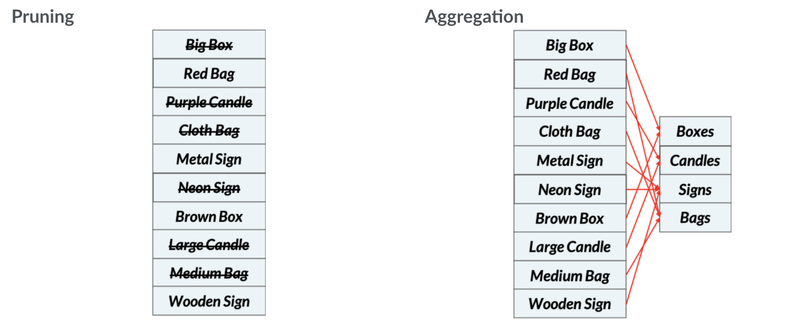

# Aggregating and Pruning


## Aggregation
_Groups items together into categories_

1. Select the columnn names for bags
```python
bag_headers = [i for i in onehot.columns if i.lower().find('bag') >= 0]
```

2. Identify column headers
```python
bags = onehot[bag_headers]
```

3. Sum over columns to check whether at least one item in the transaction is a bag
```python
bags = (bags.sum(axis=1) > 0.0).values
```

## Pruning
_Remove items and rules  with low support or poor performance_

- Counting itemsets

<a href="https://www.codecogs.com/eqnedit.php?latex=\inline&space;\text{\&hash;&space;itemsets&space;generate&space;by&space;choosing&space;k&space;items&space;from&space;a&space;set&space;of&space;n}&space;=&space;\bigl(\begin{smallmatrix}&space;n\\k&space;\end{smallmatrix}\bigr)&space;=&space;\frac{n!}{(n-k)!k!)}" target="_blank"></a>

- Reducing the number of itemsets
  - Excluding datasets with more than k items
  - Apriori Algorithm

### The Apriori Algorithm
_Retain items that are frequent - exceed minimal level of support_
- Principle: subsets of frequent sets are frequent

```python
from mlextend.frequent_patterns import apriori

frequent_itemsets = apriori(onehot, min_support=0.0005, max_len=4, use_colnames=True)
```

### Basic Apriori Results Pruning
1. Compute association rules
```python
rules = association_rules(frequent_itemsets, metric='support', min_threshold=0.001)
```

