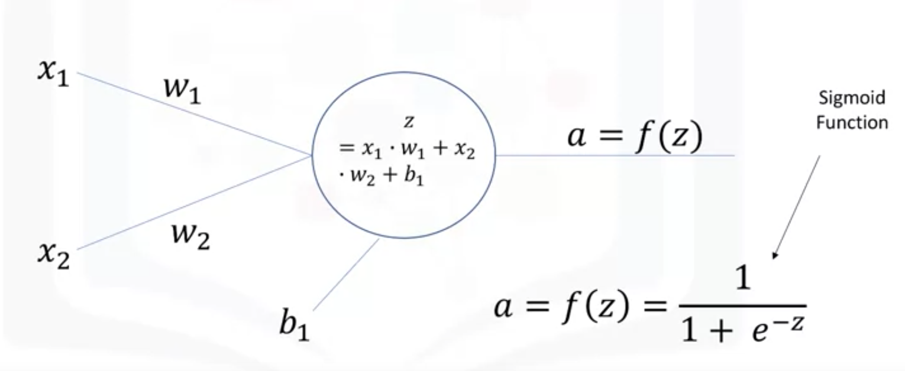
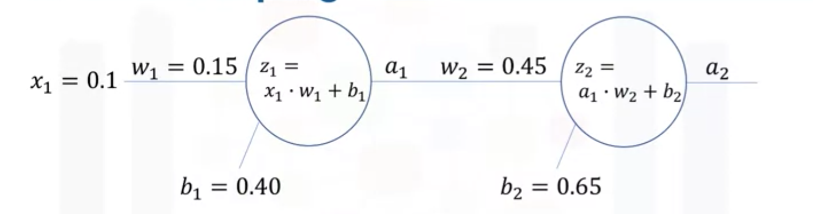
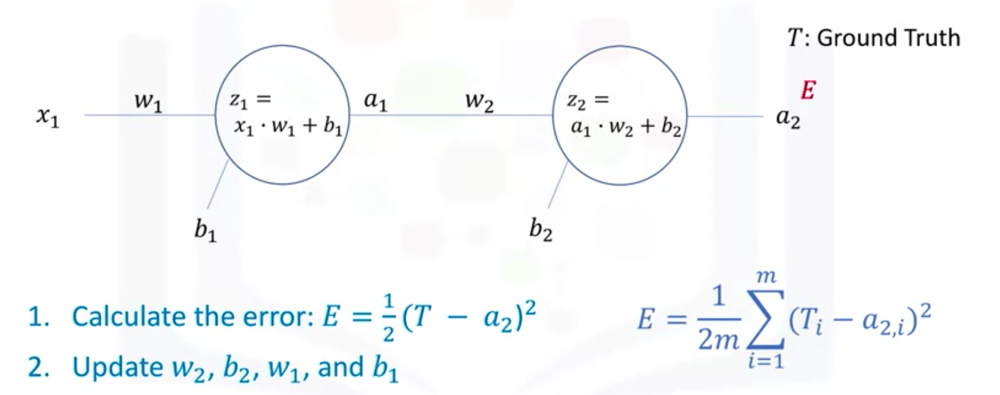
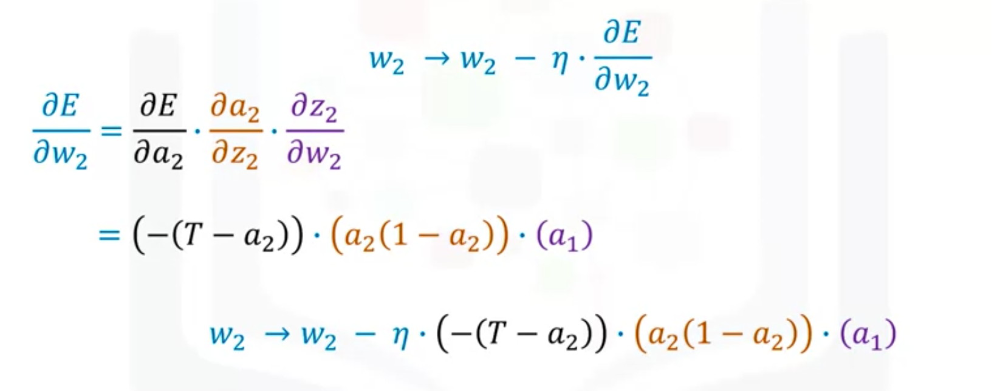

# Artificial Neural Networks
1. Forward propagation
2. Backpropagation
3. Activation Functions

## Gradient Descent
_Finding the minimum of a function_

## Activation function
_Decides whether a neuron should be activated or not -> whether the information the neurou receives is relevant or not_

- Enable non-linear transformation -> to perform more complex task
- A neural network without activation function is just a linear regression model

1. Binary step function
2. Linear function
3. Sigmoid funciton

- As the gradient approaches 0, the network doesn't really learn
- are avoided due to the vanishing problem

4. Hyperbolic Tangent Function

- a scaled function of the sigmoid function
- are avoided due to the vanishing problem

5. ReLU (Rectified Linear Unit)

- most widely used & only used in hidden layers
- does not activate all the neurons at the same time, making the network sparse

6. Leaky ReLU
7. Softmax Function
- a type of sigmoid function
- to handle classification problem

## Vanishing Gradient
- Using activation function like **sigmoid function** (which makes the intermediate values between 0 and 1)
- so gradients get smaller and smaller 
- the training process takes too long and the prediction accuracy is compromised

## Forward propagation

- The output of the first neuron will be passed as the input of the second neuron

## Backpropagation

1. Calculate network output using forward propagation
2. Calculate the error E (mean squared error) between the ground truth and the estimated output
3. Update weights and biases through backpropagation per the following equations:

4. Repeat the above three steps until # of iterations/epochs is reached or error between group truth and predicted output is below a predefined threshold
