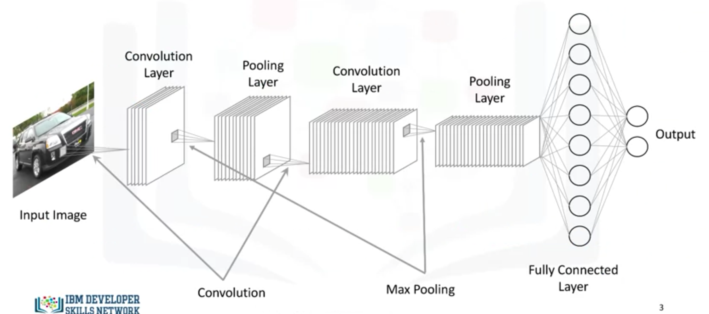
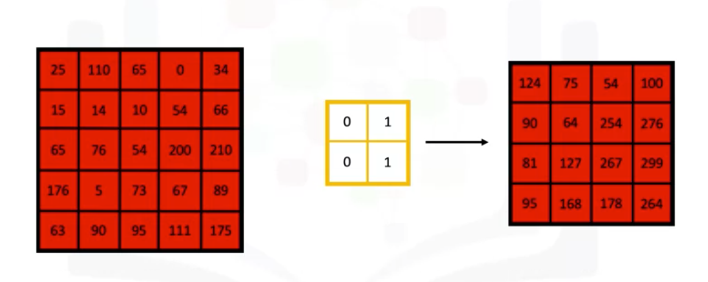
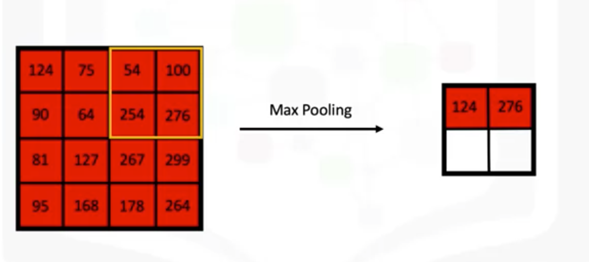

# Shallow Versus Deep Neural networks
- Shallow: consists of one hidden layer
- Deep: consists of more hidden layers and has a large number of neurons in each layer

## Convolutional Neural Networks (CNNs)
- Assumption: take inputs as images
- Usage: image recognition, object detection, other CV applications



- Input
  - n * m * 1: for gray scaled images
  - n * m * 3 (red, green, blue): for colored images
- Convolutional Layer
  - create an empty matric to save the results of the process
  - sliding the filter over the images
  - computing the dot product between the filter and the overlapping pixel values
  - storing the result in the empty matrix
  - repeat the moving steps by one cell
  
  - the more filter, the more we're able to preserve the spatial demension better
- Pooling Layer
  - Objective
    - Reduce spatial demensions of data propagating through the network
    - Provides spatial variance which enables recognize objects in the image even if the object does not exactly resemble the original object
  - Max pooling: for each section of the output, keep the highest value
    
  - Average pooling: keep the average value of each area
- Fully-connected Layer
  
  - Flatten the output of the last convolutional layer and connect every node of the current layer with every other node in the next layer
  - Output: n-dimensional vector (n: number of classes of the problem)

### Keras Code
```python
model = Sequential()
input_shape = (128, 128, 3)
model.add(Conv2D(16, kernel_size(2, 2), strides=(1,1), activation='relu', input_shape=input_shape))
model.add(MaxPooling2D(pool_size(2, 2), strides=(2,2)))
model.add(Conv2D(32, kernel_size(2, 2),  activation='relu'))
model.add(MaxPooling2D(pool_size(2, 2), strides=(2,2)))
model.add(Flatten())
model.add(Dense(100, activation='relu'))
model.add(Dense(num_classes, activation='softmax'))  # convert output to probabilities
```

## Supervised Learning Models
