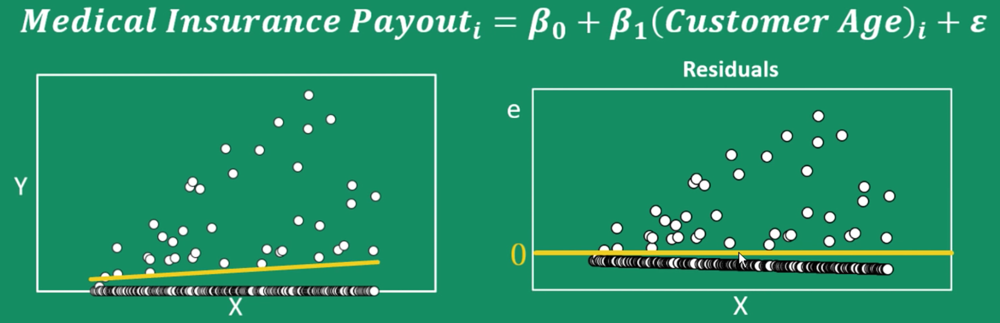
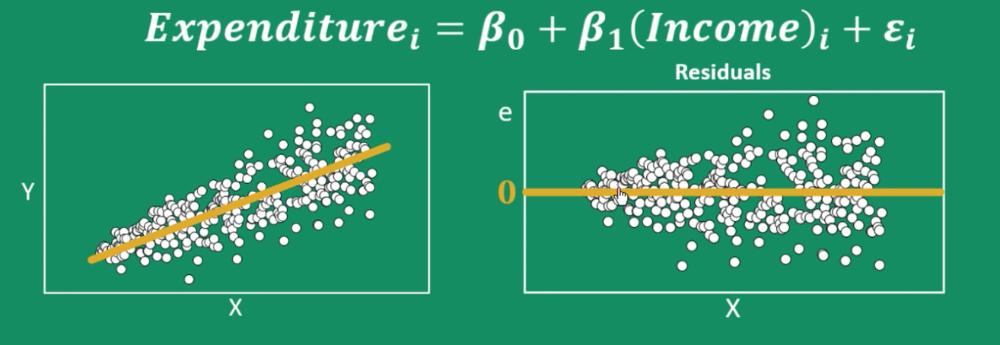
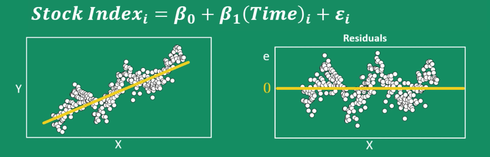
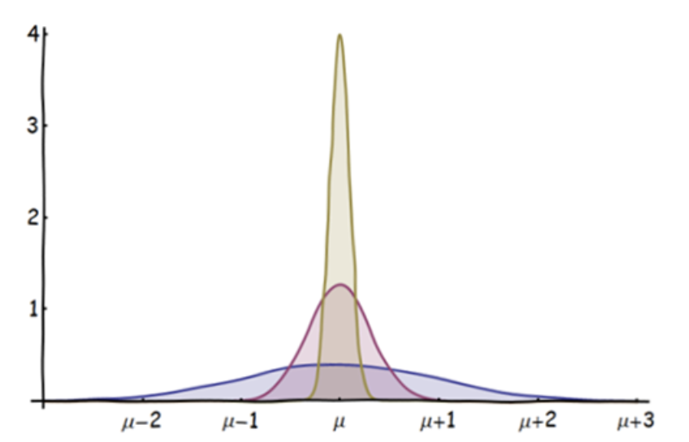
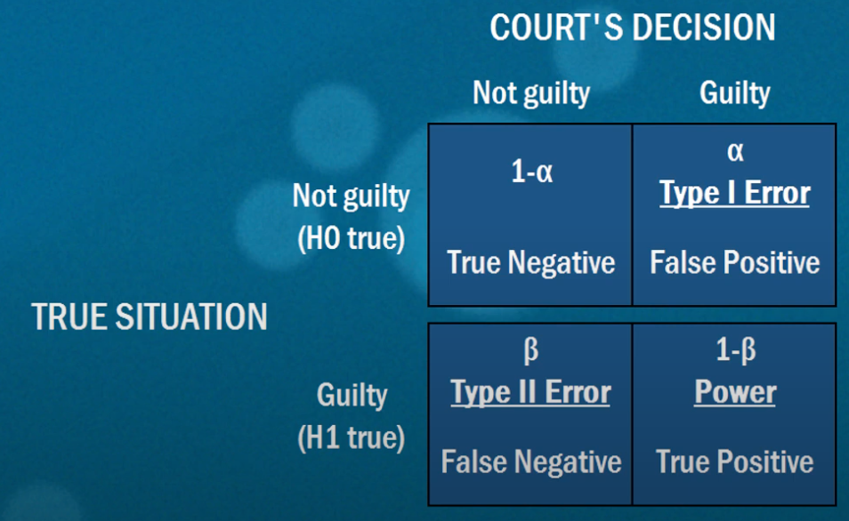
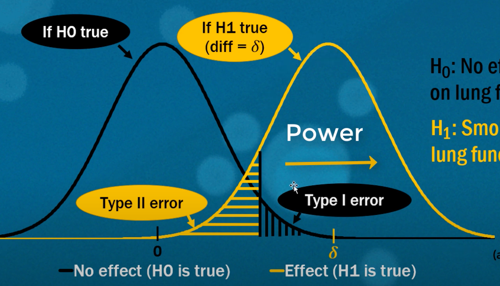
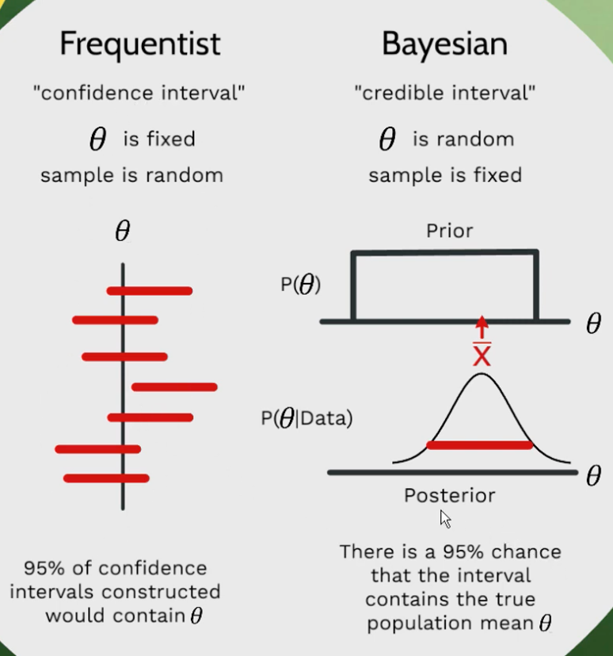

# Statistics

1. [Linear Regression Assumptions](#linear-regression-assumptions)
2. [Central Limit Theorem (CLT)](#central-limit-theorem-clt)
3. [Law of Large Numbers](#law-of-large-numbers)
4. [Nonparametric](#nonparametric)
5. [Other Terminology](#other-terminology)
    - [R-squared](#r-squared)
    - [Adjusted R-squared](#adjusted-r-squared)
    - [Standard Error (SE)](#standard-error-se)
    - [P-value](#p-value)
    - [Statistical Significance](#statistical-significance)
6. [Type 1 and Type 2 Errors](#type-1-and-type-2-errors)
    - [Statistical Power](#statistical-power)
7. [Confidence Interval](#confidence-interval)
  
## Linear Regression Assumptions
1. Linearity
2. No/Little Multicollinearity
3. Exogeneity - No omitted variables
4. Normally distributed Error Term
5. Homoscedastic - Constant Variance of Error Terms
6. Independent Error Terms - No Autocorrelation

### 1. Linearity
_Linear relationship between the independent and dependent variables_

  

#### Detection
Residual plots  (against X), nicely and event spread

### 2. No or little Multicollinearity
_Independent variables are not highly correlated with each other_

#### Why 
- Undermines the statistical significance of an independent variable
- Regression coefficient represents the mean change in  the dependent variable for each 1 unit change in an independent variable when all of the other independent variables constant
- The coefficients become very sensitive to small changes in the model
- Reduces the precision of the estimate coefficients

#### Detection
- VIF (Variance Inflation Factor), VIF > 5/10 = multicollinearity
- Correlation matrix, heatmap, pairplots

#### Solution
- Remove independent variables with high VIF values
- Adding interaction term won’t fix the problem

### 3. Exogeneity - No omitted variables
_Each independent variable gives us information completely external to the rest of the model_

#### Why
- The model can only be predictive, can’t generate inference

#### Detection
- Intuition
- Check correlation

#### Solution
Use instrumental variables

### The Error Term Assumptions
_Investigated with plots of the observed individuals against X/y_ 

  

### 4. Normally distributed
- When size is large, doesn't matter, apply central limit theorem

#### Detection
- Normality test: e.g. Shapiro-Wilk
- Histogram/QQ plot of residuals
- Scatter plot of residuals against X, should get vertical cross sections of each X value, most of the data should be centered around the 0 line

#### Solution
Change functional form, e.g. log

### 5. Homoscedastic 
_Has constant variance at every value of X_

- `/hoʊmoʊsɪdæsˈtɪk/`

**Example**

When income is small, the variance of spending is small. When income increases, the variance increases as some may spend little while others may spend a lot.

#### Detection
- Scatter plot: residuals are equal across the regression line

#### Solution
- Log things

### 6. Independent - No Autocorrelation
_When there's a natural order of X_

**Example**

Stock price is not independent from the previous price

#### Detection
- Scatterplot
- Durbin-Watson’s d tests
  - the statistic will always be between 0 and 4
  - closer to 0, more positive serial correlation
  - closer to 4, more negative serial correlation

## Central Limit Theorem (CLT)
_With a **large** enough collection of **samples** from the same population, the **sample means** will be **normally distributed**_

  

- Don't make any assumptions about the underlying distribution of the data
- With a large sample of 30+, the theorem will always ring true
- Usage: perform hypothesis test

## Law of Large Numbers
_As the **size of a sample is increased**, the **estimate of the sample mean** will **more accurately** reflect the population mean_

### Sampling
- A sample is a collection of data from a certain population that is meant to represent the whole

## Nonparametric
_Data that does not fit a known or well-understood distribution_
- Data
  - in ordinal, intervals form
  - does not fit a well understood shape
  - almost parametric but contains outliers, multiple peaks, a shift
- Nonparametric methods are less powerful than their parametric counterparts, because they must be generalized to work for all types of data

### Ranking Data
- Before a nonparametric statistical method can be applied, the data must be converted into a rank format

### Normality Testing
- Shapiro-Wilk test
- Kolmogorov-Smirnov test
- Anderson-Darling test

### Correlation
- Spearman’s rank correlation coefficient
- Kendall rank correlation coefficient

### Compare Sample Means
- Mann-Whitney U Test
- Wilcoxon Signed-Rank Test
- Kruskal-Wallis H Test
- Friedman Test

## Other Terminology
### R-squared
_The proportion of the variance for a dependent variable that's explained by an independent variables in a regression model_

- Variation: the difference between each point and the mean of Y
- Squared: the difference in each data point is squared so that the points below the mean doesn’t cancel out the points above the mean
- ranges from 0 to 1 (100%)
- An R-squared of 100% means that all movements of a dependent variable are completely explained by movements in the independent variables
- 

#### Limitation
- It doesn't convey the reliability of the model
- R-Squared only works as intended in a simple linear regression model with one explanatory variable. With a multiple regression made up of several independent variables, the R-Squared must be adjusted

#### Adjusted R-squared
- Every predictor added to a model increases R-squared and never decreases it
- Adjusted R-squared compensates for the addition of variables and only increases if the new term enhances the model more than what is predicted by chance and 

### Standard Error (SE)
_Standard deviation of a statisstic_

### Hypothesis Testing
_Assessment of how reasonable the observed data are assuming a hypothesis is true_

### Test Statistic
_A basis of comparison between the observed data and the data simulate under the null hypothesis_

#### Z-scores
_The number of standard deviations from the mean a data point is_

- The higher/lower the z-score, the **less** likely the result is happen by chance

### Significance Level
_Probability of rejecting the null hypothesis when it is true_
- A significance level of 0.05 indicates a 5% risk of concluding that a difference exists when there is no actual difference
- If the p-value is < significance level, we can reject the null hypothesis

### Statistical Significance
Quantifies whether a result is likely **due to chance** or to some factor of interest
- low p-value

### P-value
_Probability of an observed (or more extreme) result assuming that the null hypothesis is true_
- The closer to 0, the more confidence we have that A and B are different
- Commonly used threshold: 0.05
- e.g. a vaccine study produced a P value of 0.04: Assuming that the vaccine had no effect, you’d obtain the observed difference or more in 4% of studies due to random sampling error
- Do NOT measure the probability that the studied hypothesis is true

### Practical Significance
_Whether the difference of the data from the null hypothesis matters for practical considerations_

e.g. test statistic is Pearson correlation, p-value is the fraction of replicates that have the correlation at least as large as observed

The lower the p-value, the less likely the results are due purely to chance. 

## Type 1 and Type 2 Errors

- Type I Error (alpha) : incorrectly rejecting a true hypothesis, level of significance (usually 5%)
- Type II Error (beta) : failed to reject a false hypothesis
- True Negative (1-alpha)
- Power (1-beta) : the ability of the test to correctly reject a false null hypothesis

### Statistical Power
_The ability of the test to correctly reject a false null hypothesis_
- 
- How is power affected when
    - standard deviation increases: power decreases
    - number of observations increases: more confident about the sample mean -> the distribution gets skinny -> less overlap -> power increases
    - the difference (between H0 and H1 stats) increases: less overlap -> power increases

## Confidence Interval
_How likely the result is robust and repeatable_
- Calculation
    - 
        - s: sample standard deviation, the spread of the sample data, the more uncertainty of the sample -> the more uncertainty in the confidence interval
        - n: number of observations, more samples -> more likely the sample mean approximates the population mean
    - 

- Frequentist vs Bayesian

    

    - Frequentist: confidence interval, theta is fixed, sample is random
    - Bayesian: credible interval, theta is random, sample is fixed
                                                                          
- Interpretation
    - Example: A 95% confidence interval
        - If we repeat the experiment over and over again, we would expect the interval to cover the true value in the population 95% of the time.
        - 95% of intervals constructed contain the true mean

