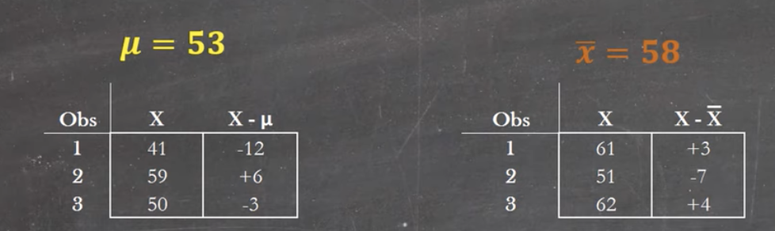
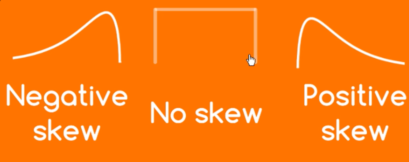
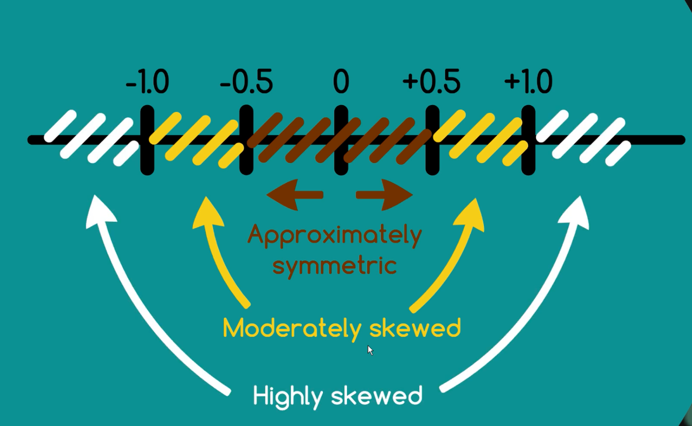

# Descriptive Statistics

  

- [Median](#Median)
- [Variance](#Variance)
- [Skewness](#Skewness)

## Median
_Middle number of the series when ordered_

### Mean vs Median
- Symmetric distributions: Mean =  Median
  - Uniform distribution
  - Bell curve
  - Bimodal distribution
- Asymmetric distributions
  - median is more robust/reflective of the central tendency when there're **extreme values**/heavily skewed
- When median is preferred
  - house prices
  - car prices
  - salaries

## Variance
_Describe the **spread** of the data_
- 
- 
- Variance: the average **squared deviation** from the **population** mean
- Why divide by n-1
  - sample mean is only one possible position for the true population mean
  - at any other position, the sum of squares would be larger
  - using n-1 instead of n would adjust the variance estimate upwards
- Degree of Freedom
  - 
  - Population variance - Three degrees of freedom (three pieces of independent information): 
  - Sample Variance - Two degrees of freedom: 

## [Skewness](https://www.youtube.com/watch?v=_vDRKlTz7yo)

  

- Symmetric/no skew: mean = median = mode
- Positively/Right skewed: Mode < Median < Mean (pulled by the extreme values on the right)
- Negatively/Left skewed: Mean < Median < Mode
  - e.g. relatively easy test that most students score a high mark, distribution of age of death in a developed country
- The greater the skew, the greater the distance between mode, median, and mean

### Pearsons' Method
_Calculate skewness_
1. Mode Skewness
  - May not hold in small samples as the mode can be all over the place

  

2. Median Skewness
  - More robust in smaller samples

  

- In appreciably small data, 

### Moment based calculation
- 
- 
- 
- 
- 

### Visualization

  

